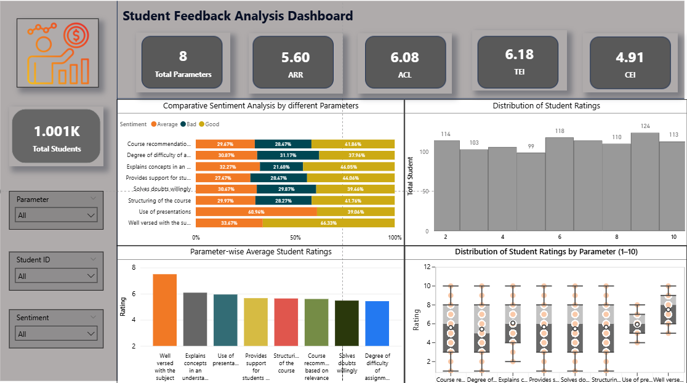

📊 Student Feedback Analysis Dashboard (Power BI)
📌 Project Overview

This project focuses on analyzing student feedback data to evaluate teaching effectiveness and course quality using Power BI.
The dashboard transforms raw student ratings into actionable insights that help identify strengths, gaps, and improvement areas in teaching and course design.

The analysis is built on 1,000+ student responses across multiple teaching parameters, using interactive visuals and calculated indices.

🎯 Objectives

Measure overall Teaching Effectiveness and Course Effectiveness

Understand student sentiment across different teaching parameters

Identify strong-performing and weak-performing areas

Enable interactive exploration using slicers and filters

🧮 Key Metrics & KPIs

Total Students – Number of unique student responses

ARR (Average Rating) – Overall average student rating

ACL (Average Comfort Level) – Indicates student learning comfort

TEI (Teaching Effectiveness Index) – Measures teaching quality based on core parameters

CEI (Course Effectiveness Index) – Measures course design and relevance

📊 Dashboard Overview

Below is the main dashboard showcasing KPIs, sentiment analysis, rating distributions, and parameter-wise insights:

🔍 Key Insights

Strong Subject Knowledge
“Well versed with the subject” consistently receives the highest ratings, indicating solid domain expertise.

Moderate Teaching Effectiveness
Teaching-related parameters perform reasonably well, but there is room to move from average to excellent.

Assignment Difficulty is a Weak Area
Ratings for assignment difficulty are comparatively lower, suggesting misalignment with teaching or student expectations.

High ‘Average’ Sentiment Share
Most parameters fall into the “Average” sentiment bucket—signaling stability but limited excellence.

Course Design Needs Attention
CEI is lower than TEI, highlighting improvement opportunities in course structure, relevance, and delivery methods.

🛠 Tools & Techniques Used

Power BI Desktop

DAX (Calculated Measures & KPIs)

Data Modeling & Unpivoting

Custom Visuals (Box plots, histograms, stacked bar charts)

Interactive Slicers (Parameter, Student ID, Sentiment)

📁 Repository Contents

Student_Feedback_Analysis.pbix – Power BI report file

Dashboard-Overview.png – Screenshot of the dashboard

README.md – Project documentation

🚀 How to Use

Download the .pbix file

Open it using Power BI Desktop

Use slicers to explore insights by:

Parameter

Student ID

Sentiment

📬 Contact

If you’d like to discuss this project, share feedback, or collaborate, feel free to connect with me on LinkedIn.
